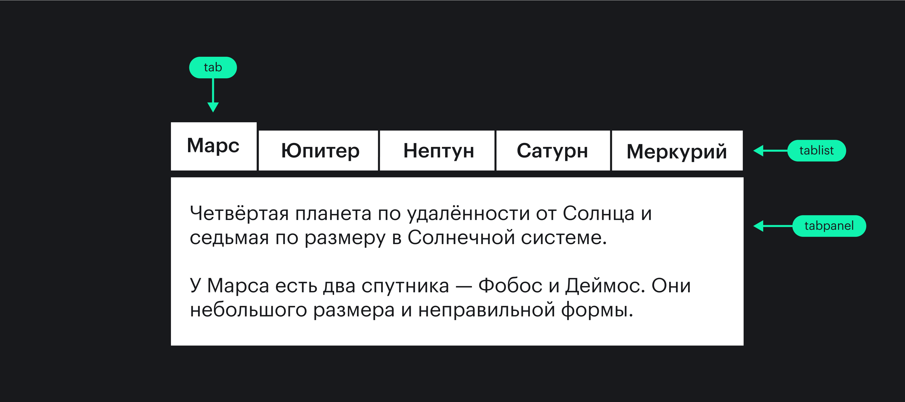

## Кратко

[Самостоятельная роль виджета](/a11y/aria-roles/#roli-vidzhetov) из [WAI-ARIA](/a11y/aria-intro/#specifikaciya), которая означает содержимое или панель вкладки.

В HTML нет тега, похожего на роль `tabpanel`.

## Пример

```html
<div
  role="tabpanel"
  id="tabpanel-1"
  aria-labelledby="tab-1"
  tabindex="0"
>
  <p>Травоядные животные с коротким хоботом, которые живут в лесу.</p>
</div>
```

<iframe title="div с ролью tabpanel" src="demos/tabpanels/" height="350"></iframe>

При фокусе на содержимом вкладки [скринридер](/a11y/screenreaders/) прочтёт его примерно так: «Тапиры. Травоядные животные с коротким хоботом, которые живут в лесу».

## Как пишется

Роль `tabpanel` можно задать любому тегу, но лучше всего подходят нейтральные [`<div>`](/html/div/) и [`<span>`](/html/span/).

Элемент с ролью `tabpanel` добавляют после списка вкладок [с ролью `tablist`](/a11y/role-tablist/).

```html
<!-- Список вкладок -->
<div
  role="tablist"
  aria-label="Необычные животные"
>
  <!-- Вкладка -->
</div>

<!-- Содержимое вкладки-->
<div
  role="tabpanel"
  id="tab-1"
>
  <p>Травоядные животные с коротким хоботом, которые живут в лесу.</p>
</div>
```

Обязательно свяжите содержимое `tabpanel` с нужной вкладкой [`tab`](/a11y/role-tab/). Для этого используйте атрибут [`aria-controls`](/a11y/aria-controls/) для `tab` и добавьте `id` с таким же значением к `tabpanel`.

```html
<button
  role="tab"
  aria-controls="tabpanel-1"
>
  Тапиры
</button>
<div
  role="tabpanel"
  id="tabpanel-1"
>
  <p>Травоядные животные с коротким хоботом, которые живут в лесу.</p>
</div>
```

Другой способ связать `tabpanel` с `tab` — использовать атрибут [`aria-labelledby`](/a11y/aria-labelledby/) для содержимого вкладки.

```html
<button
  role="tab"
  id="tab-1"
>
  Тапиры
</button>
<div
  role="tabpanel"
  aria-labelledby="tab-1"
>
  <p>Травоядные животные с коротким хоботом, которые живут в лесу.</p>
</div>
```

[У `aria-controls` пока плохая поддержка](https://a11ysupport.io/tech/aria/aria-controls_attribute), так что часто для надёжности этот атрибут совмещают с `aria-labelledby`.

Элементам с ролью `tabpanel` можно также задавать все остальные [глобальные ARIA-атрибуты](/a11y/aria-attrs/#globalnye-atributy) и некоторые [атрибуты виджетов](/a11y/aria-attrs/#atributy-vidzhetov).

Содержимое вкладки тоже должно получать фокус с клавиатуры, как сама вкладка. Поэтому задайте `tabpanel` атрибут [`tabindex`](/html/global-attrs/#tabindex) со значением `0`. В этом случае пользователь попадёт на связанное содержимое активной вкладки, если нажмёт на <kbd>Tab</kbd>.

Когда вкладка неактивна, то нужно скрыть связанное с ней содержимое `tabpanel`. Это можно сделать с помощью атрибута [`hidden`](/html/hidden/) или CSS-свойств [`display: none`](/css/display/) или [`visibility: hidden`](/css/visibility/). Важно выбрать способ, который точно скроет содержимое вкладки не только визуально, но и от скринридера. Больше узнать об этом можно из «[Как скрыть содержимое от скринридеров](/a11y/content-hidden/)».

Внутри `tabpanel` можно размещать любое содержимое, не только текст.

### Поддержка клавиатуры

Когда пользователь перешёл к `tablist` с помощью <kbd>Tab</kbd>, в фокусе должна оказаться первая активная вкладка с ролью `tab`. При повторном нажатии <kbd>Tab</kbd> в фокусе оказывается содержимое вкладки.

Между горизонтальными вкладками перемещаемся стрелками влево и вправо, а вертикальными — вверх и вниз. Когда на вкладке сделан фокус, она может раскрываться либо автоматически, либо после нажатия на <kbd>Enter</kbd> или пробел.

Если со вкладкой связано выпадающее меню, то рекомендуют поддерживать для его открытия сочетание клавиш <kbd>Shift + F10</kbd>.

Дополнительно, но не обязательно, можно добавить поддержку <kbd>Home</kbd> для возврата к первой вкладке, <kbd>End</kbd> для перехода к последней вкладке, <kbd>Delete</kbd> для закрытия текущей вкладки и перехода к следующей или предыдущей в зависимости от количества вкладок.

## Как понять

Вкладки — это популярный паттерн в вебе и десктопных программах. Когда нажимаешь на название вкладки, открывается новая область с её содержимым или целая страница, как в браузерах.

Устройство вкладок в виде схемы:


